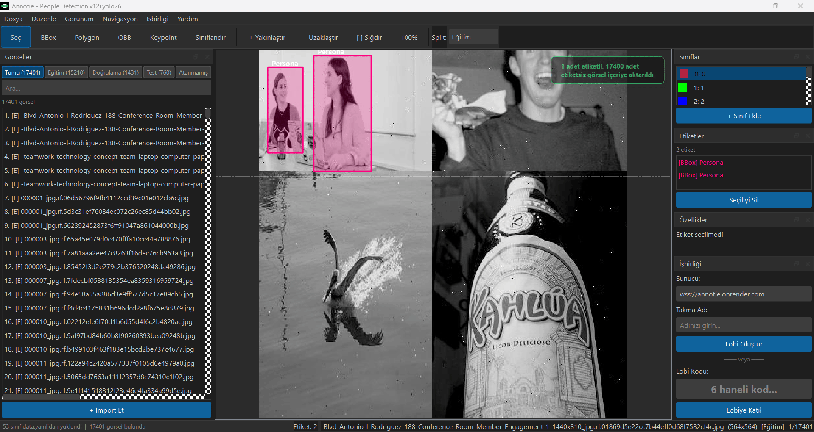
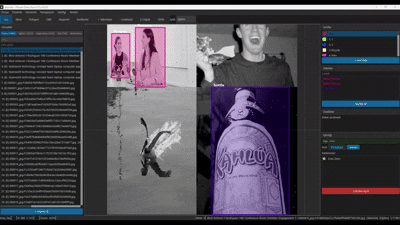

<div align="center">
  
  <h1>Annotie</h1>
  <p>
    YOLO formatinda veri seti etiketleme icin ucretsiz, acik kaynakli masaustu uygulamasi<br/>
    Free, open-source desktop annotation tool for YOLO-format datasets
  </p>

  
  
  
  
  
</div>

---

## TR Turkce | EN [English](#-english)

---

<p align="center"></p>

## Annotie Nedir?

Annotie, YOLO formatinda veri seti olusturmak ve yonetmek icin gelistirilmis masaustu gorsel etiketleme uygulamasidir. Tum YOLO gorev tiplerini tek bir aracta destekler -- abonelik yok, limit yok, bulut yuklemesi yok.

---

## Ozellikler

### Desteklenen Etiket Tipleri
| Tip | YOLO Gorevi |
|-----|-------------|
| Bounding Box (BBox) | Detection (Nesne Tespiti) |
| Polygon | Segmentation (Segmentasyon) |
| Oriented Bounding Box (OBB) | OBB Detection |
| Keypoints | Pose Estimation (Poz Tahmini) |
| Classification | Image Classification (Goruntu Siniflandirma) |

Ayni veri setinde farkli etiket tipleri bir arada kullanilabilir. YOLOv5, v8, v10, v11, v12 ve sonrasi ile uyumludur.

### Gercek Zamanli Isbirligi (Collaboration)

Annotie, birden fazla kisinin ayni veri seti uzerinde es zamanli calismasina olanak tanir -- ayni odada veya dunya uzerinde farkli lokasyonlarda.

<p align="center"></p>

**Nasil Calisir:**
1. Bir kullanici **Lobi Olustur**'a tiklar, 6 haneli bir kod uretilir
2. Diger kullanicilar bu kodu girerek lobiye katilir
3. Tum annotation degisiklikleri (olusturma, silme, tasima, sinif degistirme) anlik olarak senkronize edilir

**Ozellikler:**
- Lobi tabanli sistem -- kod paylasarak davet
- Annotation olusturma, silme, boyutlandirma ve sinif degisikligi anlik sync
- Sinif ekleme, silme ve yeniden adlandirma sync
- Presence sistemi -- kim hangi gorselde calisiyor gosterilir
- Ayni gorselde baska biri calisiyorsa uyari banner'i
- Otomatik yeniden baglanma ve mesaj kuyruklama
- Sunucu ucretsiz olarak Render.com uzerinde calisir -- sifir maliyet

### Veri Seti Yonetimi
- Standart YOLO klasor yapisini **otomatik tanir**, `data.yaml` dosyasini (siniflar, yollar) otomatik okur
- **Train / Validation / Test / Atanmamis** split sistemi -- her gorsele split atanabilir
- **Iki farkli gorsel import modu:**
  - `Ekle (Add)` -- mevcut split korunur, yeni gorseller eklenir
  - `Uzerine Yaz (Replace)` -- secilen split temizlenir, yeni gorseller yazilir
- **Etiket import** -- baska bir klasordeki `.txt` dosyalarini dosya adi eslestirme ile mevcut gorsellere uygular
- **Export** -- standart YOLO yapisinda ve otomatik olusturulan `data.yaml` ile export eder; arka planda calisir, canli ilerleme bari gosterir (arayuz donmaz)

### Beklenen Klasor Yapisi

```
dataset/
+-- train/
|   +-- images/
|   |   +-- image1.jpg
|   +-- labels/
|       +-- image1.txt
+-- valid/
|   +-- images/
|   |   +-- image2.jpg
|   +-- labels/
|       +-- image2.txt
+-- test/
|   +-- images/
|   |   +-- image3.jpg
|   +-- labels/
|       +-- image3.txt
+-- data.yaml
```

Annotie bu yapiyi acilista okur, export'ta ayni yapida yazar -- Ultralytics YOLO ile dogrudan kullanima hazir.

### Etiketleme Arayuzu
- **Tikla-birak ile etiket cizimi** -- tikla = etiket koy, surukle = canvas'i kaydir
- Zoom seviyesinden bagimsiz sabit boyutlu kose tutamaclari, yalnizca hover/secimde gorunur
- Undo / Redo destegi
- **Otomatik kaydetme** -- her degisiklik aninda `.txt` dosyasina otomatik yazilir


### Navigasyon
- `A` / `D` -- onceki / sonraki gorsel (tum gorseller)
- `<-` / `->` -- yalnizca **etiketli** gorseller arasi gecis
- Sol panel, klavye navigasyonunda otomatik olarak highlight ve scroll takibi yapar
- Split sekmeleri **goreli numaralandirma** gosterir (Egitim sekmesindeki 1. gorsel, global indeksten bagimsizdir)

### Son Kaldigin Yer (Position Memory)
Buyuk veri setlerinde calisirken en ise yarayan ozelliklerden biri:
- Konum **veri seti basina, split basina** (Tumu / Egitim / Dogrulama / Test) ayri ayri kaydedilir
- Yalnizca "Tumu" sekmesinde gezseniz bile, her gorselin hangi split'e ait oldugu bilindiginden split bazli konumlar da guncellenir
- Her veri seti gecisinde (kapatma, yeni acma, son acilanlar) otomatik kaydedilir
- Bir sonraki acilista: *"Egitim kategorisinde 150. frame'de kaldiniz"*
- Split sekmesine tiklandiginda da o kategorideki son konum gosterilir

### Arayuz / UX
- Koyu tema (Dark mode)
- Toast bildirimleri -- yesil (basari) / kirmizi (hata), animasyonlu kaybolma
- Veri seti acilisinda etiketli / etiketsiz gorsel sayisi, `data.yaml` eksikse uyari
- Son acilan veri setleri listesi, konum hafizasiyla
- Pencere durumu (boyut, panel konumlari) kaydedilir ve restore edilir
- **Odak Modu** (`F12`) -- tum paneller gizlenir, yalnizca canvas kalir

---

## Indirme

Hazir kurulum dosyalari [Releases](https://github.com/EnesSoydan/Annotie/releases) sayfasinda mevcuttur.

| Platform | Dosya | Gereksinim |
|----------|-------|------------|
| Windows | `Annotie-Windows.zip` | Windows 10/11 (64-bit) |
| macOS | `Annotie-macOS.zip` | macOS 11.0+ (Intel & Apple Silicon) |

**Windows:** ZIP'i cikart, `Annotie.exe` dosyasini calistir.

**macOS:** ZIP'i cikart, `Annotie.app` dosyasini Uygulamalar klasorune tasi.

---

### Guvenlik Uyarisi (Normal -- Beklenen Bir Durum)

Annotie ucretli bir Apple/Microsoft gelistirici sertifikasiyla imzalanmamistir. Bu nedenle ilk acilista her iki platformda da guvenlik uyarisi gorebilirsiniz. Bu tamamen normaldir; uygulama zararli degildir, kaynak kodunun tamami bu repoda acik olarak mevcuttur.

#### macOS -- "Annotie Acilmadi" Uyarisi

**Yontem 1 -- Sag tik ile ac (En kolay):**
1. `Annotie.app` dosyasina **sag tikla**
2. **"Ac"** sec
3. Cikan uyarida **"Ac"** butonuna bas -- bu adimdan sonra bir daha sormaz

**Yontem 2 -- Sistem Ayarlari:**
1. Uygulamayi bir kez cift tikla (uyari cikacak, kapat)
2. **Sistem Ayarlari - Gizlilik ve Guvenlik** bolumune git
3. En alta in - **"Yine de Ac"** butonuna tikla

**Yontem 3 -- Terminal:**
```bash
sudo xattr -rd com.apple.quarantine /Applications/Annotie.app
```

#### Windows -- SmartScreen Uyarisi

1. **"Daha fazla bilgi"** baglantisina tikla
2. **"Yine de calistir"** butonuna bas

---

## Kaynaktan Calistir

```bash
git clone https://github.com/EnesSoydan/Annotie.git
cd Annotie
pip install -r requirements.txt
python main.py
```

**Gereksinimler:** Python 3.10+

```
PySide6>=6.6.0
Pillow>=10.0.0
PyYAML>=6.0
numpy>=1.24.0
```

---

## Code Signing Policy

Windows icin ucretsiz kod imzalama hizmeti [SignPath.io](https://signpath.io) tarafindan saglanmakta olup sertifika [SignPath Foundation](https://signpath.org) tarafindan verilmektedir.

| Rol | Kisi |
|-----|------|
| Gelistirici & Onaylayici | [EnesSoydan](https://github.com/EnesSoydan) |

Bu uygulama, kullanici tarafindan acikca talep edilmedikce herhangi bir bilgiyi harici sistemlere iletmez.

---

## Lisans

GPL-3.0 Lisansi -- ucretsiz kullanim ve degistirme serbesttir; turetilmis calismalar da ayni lisansla acik kaynak olarak dagitilmalidir.

---
---

## EN English

<p align="center"></p>

## What is Annotie?

Annotie is a desktop image annotation application built for creating and managing YOLO-format datasets. It supports all major YOLO task types in a single tool -- no subscriptions, no limits, no cloud uploads.

---

## Features

### Annotation Types
| Type | YOLO Task |
|------|-----------|
| Bounding Box (BBox) | Detection |
| Polygon | Segmentation |
| Oriented Bounding Box (OBB) | OBB Detection |
| Keypoints | Pose Estimation |
| Classification | Image Classification |

Mixed annotations are supported -- different label types can coexist in the same dataset. Compatible with all YOLO versions (v5, v8, v10, v11, v12+).

### Real-Time Collaboration

Annotie allows multiple people to work on the same dataset simultaneously -- whether in the same room or across different locations worldwide.

<!-- <p align="center"></p> -->

**How It Works:**
1. One user clicks **Create Lobby** and a 6-digit code is generated
2. Others join the lobby by entering the code
3. All annotation changes (create, delete, move, class change) sync instantly

**Features:**
- Lobby-based system -- invite by sharing a code
- Instant sync for annotation creation, deletion, resizing, and class changes
- Class addition, deletion, and renaming sync
- Presence system -- see who is working on which image
- Warning banner when someone else is editing the same image
- Automatic reconnection and message queuing
- Server runs free on Render.com -- zero cost

### Dataset Management
- **Auto-detects** standard YOLO folder structure and reads `data.yaml` (classes, paths) automatically
- **Train / Validation / Test / Unassigned** split system -- assign any image to any split
- **Two import modes** for images:
  - `Add` -- append new images while keeping existing ones
  - `Replace` -- clear the selected split and write fresh
- **Label import** -- apply `.txt` annotation files from any folder by matching filenames
- **Export** -- produces the standard YOLO structure with an auto-generated `data.yaml`, runs in the background with a live progress bar (UI never freezes)

### Expected Folder Structure

```
dataset/
+-- train/
|   +-- images/
|   |   +-- image1.jpg
|   +-- labels/
|       +-- image1.txt
+-- valid/
|   +-- images/
|   |   +-- image2.jpg
|   +-- labels/
|       +-- image2.txt
+-- test/
|   +-- images/
|   |   +-- image3.jpg
|   +-- labels/
|       +-- image3.txt
+-- data.yaml
```

Annotie reads this structure on open and writes it back on export -- ready to use directly with Ultralytics YOLO.

### Annotation Interface
- **Click to annotate** -- click to place points/boxes, drag to pan the canvas
- Fixed-size corner handles independent of zoom level, visible only on hover/select
- Undo / Redo support
- **Auto-save** -- changes are written to `.txt` files instantly


### Navigation
- `A` / `D` -- previous / next image (all images)
- `<-` / `->` -- previous / next **labeled** image only
- Image list panel auto-scrolls and highlights current image on keyboard navigation
- Split tabs show **relative numbering** (e.g. image #1 in the Val tab is independent of its global index)

### Last Position Memory
One of the most useful features for large datasets:
- Saves your position **per dataset, per split** (All / Train / Val / Test)
- Even if you only browse in the **All** tab, per-split positions are tracked since each image's split is already known
- Position is saved on every dataset switch -- not just on app close
- On next open: *"You left off at frame 150 in the Training split"*
- Clicking a split tab also shows where you left off in that split

### UI / UX
- Dark theme
- Toast notifications -- green (success) / red (error) with fade-out animation
- On dataset open: shows labeled vs. unlabeled image count, warns if `data.yaml` is missing
- Recent files list with position memory per dataset
- Window state (size, panel positions) saved and restored
- **Focus Mode** (`F12`) -- hides all panels, only the canvas remains

---

## Download

Pre-built binaries are available on the [Releases](https://github.com/EnesSoydan/Annotie/releases) page.

| Platform | File | Requirements |
|----------|------|--------------|
| Windows | `Annotie-Windows.zip` | Windows 10/11 (64-bit) |
| macOS | `Annotie-macOS.zip` | macOS 11.0+ (Intel & Apple Silicon) |

**Windows:** Extract the ZIP and run `Annotie.exe`

**macOS:** Extract the ZIP, move `Annotie.app` to Applications.

---

### Security Warning (Normal -- Expected Behavior)

Annotie is not signed with a paid Apple/Microsoft developer certificate. Because of this, both platforms may show a security warning on first launch. This is completely normal -- the app is safe, and the full source code is publicly available in this repository.

#### macOS -- "Annotie cannot be opened" Warning

**Method 1 -- Right-click to open (Easiest):**
1. **Right-click** `Annotie.app`
2. Select **"Open"**
3. Click **"Open"** in the dialog -- it won't ask again after this

**Method 2 -- System Settings:**
1. Double-click the app once (warning will appear, close it)
2. Go to **System Settings - Privacy & Security**
3. Scroll down - click **"Open Anyway"**

**Method 3 -- Terminal:**
```bash
sudo xattr -rd com.apple.quarantine /Applications/Annotie.app
```

#### Windows -- SmartScreen Warning

1. Click **"More info"**
2. Click **"Run anyway"**

---

## Run from Source

```bash
git clone https://github.com/EnesSoydan/Annotie.git
cd Annotie
pip install -r requirements.txt
python main.py
```

**Requirements:** Python 3.10+

```
PySide6>=6.6.0
Pillow>=10.0.0
PyYAML>=6.0
numpy>=1.24.0
```

---

## Code Signing Policy

Free code signing provided by [SignPath.io](https://signpath.io), certificate by [SignPath Foundation](https://signpath.org).

| Role | Member |
|------|--------|
| Developer & Approver | [EnesSoydan](https://github.com/EnesSoydan) |

This program will not transfer any information to other networked systems unless specifically requested by the user.

---

## License

GPL-3.0 License -- free to use and modify; derivative works must be distributed under the same license as open source.
