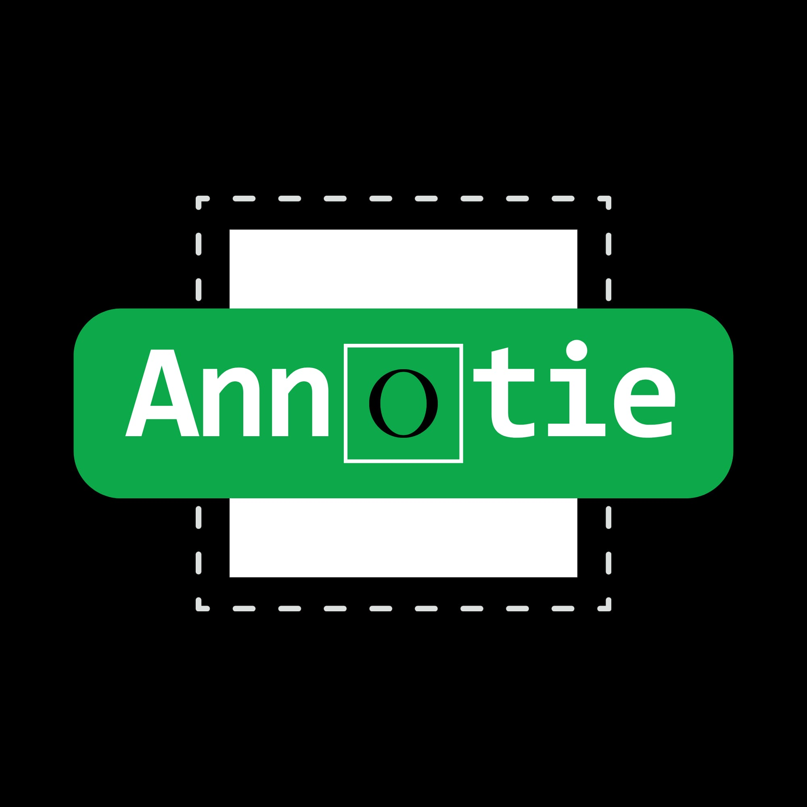

<div align="center">
  
  <h1>Annotie</h1>
  <p>Free, open-source desktop annotation tool for YOLO-format datasets</p>

  
  
  
  
  
</div>

---

## What is Annotie?

Annotie is a desktop image annotation application built for creating and managing YOLO-format datasets. It supports all major YOLO task types in a single tool — no subscriptions, no limits, no cloud uploads.

---

## Features

### Annotation Types
| Type | YOLO Task |
|------|-----------|
| Bounding Box | Detection |
| Polygon | Segmentation |
| Oriented Bounding Box (OBB) | OBB Detection |
| Keypoints | Pose Estimation |
| Classification | Image Classification |

Mixed annotations are supported — different label types can coexist in the same dataset. Compatible with all YOLO versions (v5, v8, v10, v11, v12+).

### Dataset Management
- **Auto-detects** standard YOLO folder structure and reads `data.yaml` (classes, paths) automatically
- **Train / Validation / Test / Unassigned** split system — assign any image to any split
- **Two import modes** for images:
  - `Add` — append new images while keeping existing ones
  - `Replace` — clear the selected split and write fresh
- **Label import** — apply `.txt` annotation files from any folder by matching filenames
- **Export** — produces the standard YOLO structure with an auto-generated `data.yaml`, runs in the background with a live progress bar (UI never freezes)

### Expected Folder Structure

```
dataset/
├── train/
│   ├── images/
│   │   └── image1.jpg
│   └── labels/
│       └── image1.txt
├── valid/
│   ├── images/
│   │   └── image2.jpg
│   └── labels/
│       └── image2.txt
├── test/
│   ├── images/
│   │   └── image3.jpg
│   └── labels/
│       └── image3.txt
└── data.yaml
```

Annotie reads this structure on open and writes it back on export — ready to use directly with Ultralytics YOLO.

### Annotation Interface
- **Click to annotate** — click to place points/boxes, drag to pan the canvas
- Fixed-size corner handles independent of zoom level, visible only on hover/select
- Native Qt selection handles suppressed for a cleaner look
- Undo / Redo support
- **Auto-save** — changes are written to `.txt` files within 200ms automatically

### Navigation
- `A` / `D` — previous / next image (all images)
- `←` / `→` — previous / next **labeled** image only
- Image list panel auto-scrolls and highlights current image on keyboard navigation
- Split tabs show **relative numbering** (e.g. image #1 in the Val tab is independent of its global index)

### Last Position Memory
One of Annotie's most useful features for large datasets:
- Saves your position **per dataset, per split** (All / Train / Val / Test)
- Even if you only browse in the **All** tab, the per-split positions are tracked since each image's split is already known
- Position is saved on every dataset switch — not just on app close
- On next open: *"You left off at frame 150 in the Training split"*
- Clicking a split tab also shows where you left off in that split

### UI / UX
- Dark theme
- Toast notifications — green (success) / red (error) with fade-out animation
- On dataset open: shows labeled vs. unlabeled image count, warns if `data.yaml` is missing
- Recent files list with position memory per dataset
- Window state (size, panel positions) saved and restored
- **Focus Mode** (`F12`) — hides all panels, only the canvas remains

---

## Download

Pre-built binaries are available on the [Releases](https://github.com/EnesSoydan/Annotie/releases) page.

| Platform | File | Requirements |
|----------|------|--------------|
| 🪟 Windows | `Annotie-Windows.zip` | Windows 10/11 (64-bit) |
| 🍎 macOS | `Annotie-macOS.zip` | macOS 11.0+ (Intel & Apple Silicon) |

**Windows:** Extract the ZIP and run `Annotie.exe`

**macOS:** Extract the ZIP, move `Annotie.app` to Applications, then on first launch: Right-click → Open → Open

---

## Run from Source

```bash
# Clone the repository
git clone https://github.com/EnesSoydan/Annotie.git
cd Annotie

# Install dependencies
pip install -r requirements.txt

# Run
python main.py
```

**Requirements:** Python 3.10+

```
PySide6>=6.6.0
Pillow>=10.0.0
PyYAML>=6.0
numpy>=1.24.0
```

---

## Build

Builds are automated via GitHub Actions on every version tag push (`v*`). To build locally:

```bash
pip install pyinstaller
pyinstaller Annotie.spec --noconfirm
```

---

## License

MIT License — free to use, modify, and distribute.
